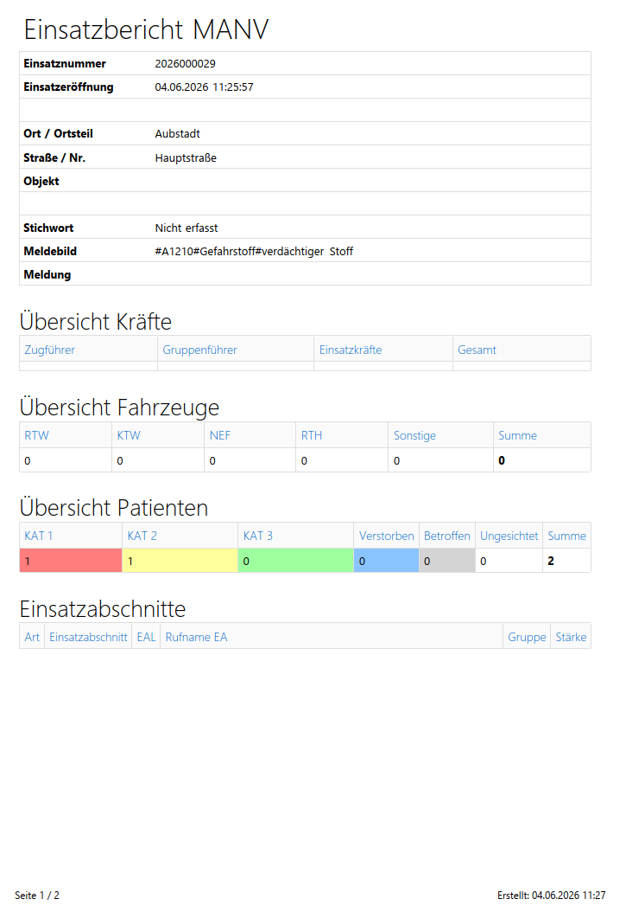
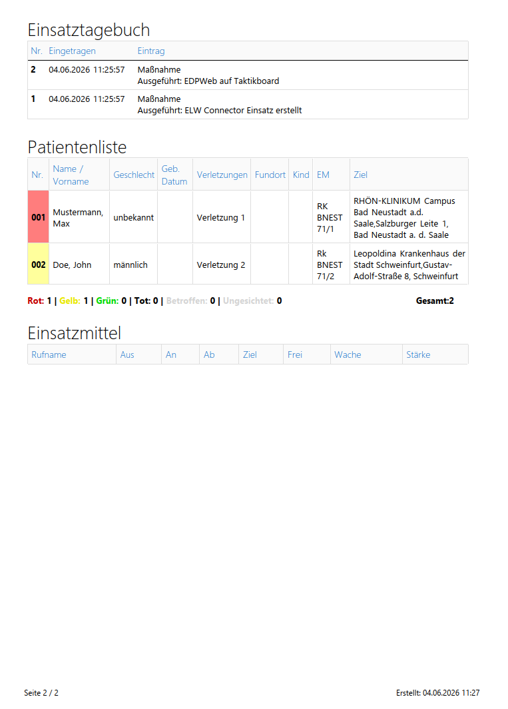
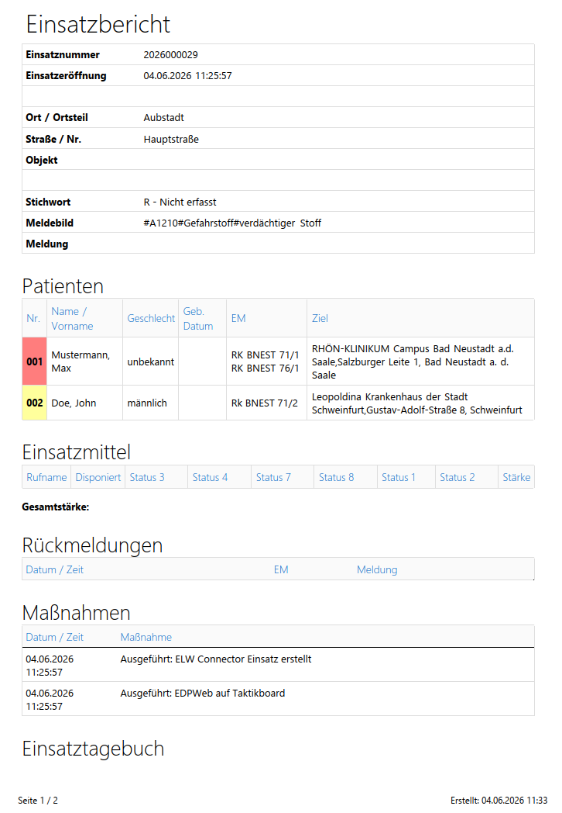
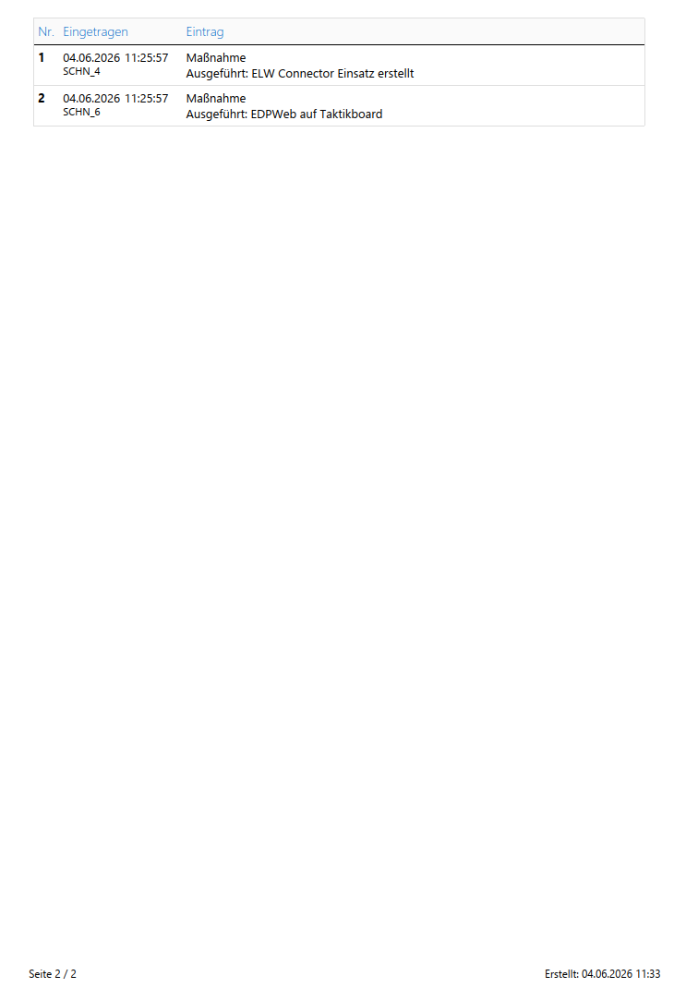

## Lageübersicht
> This section covers a quick report which we use for a brief overview
### Example

## MANV
> This section covers a report which we use for a mission summary
### Example

## Sandienstprotokoll
This section covers a a report spanning multiple missions in EDP and is used for 'Sandienste'
